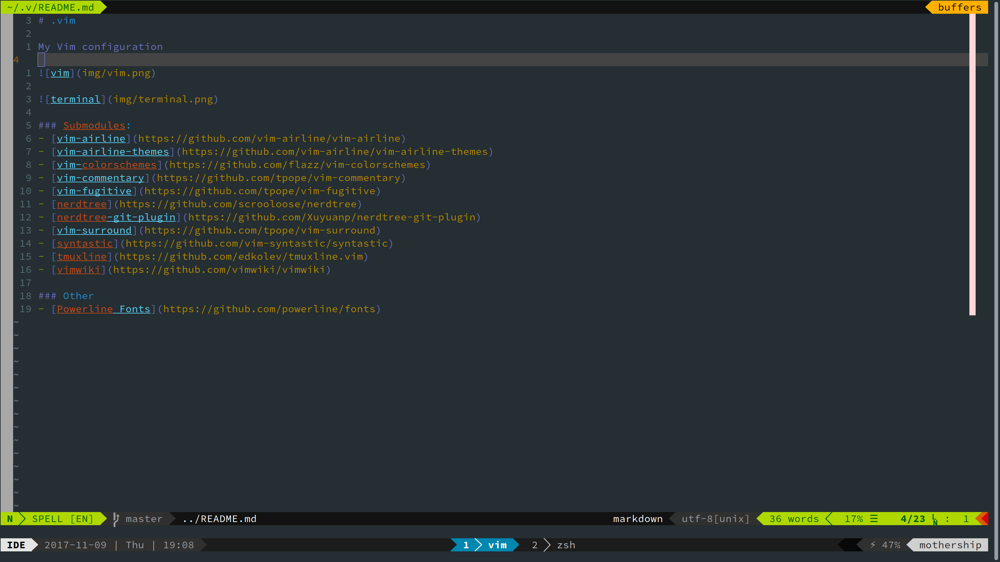
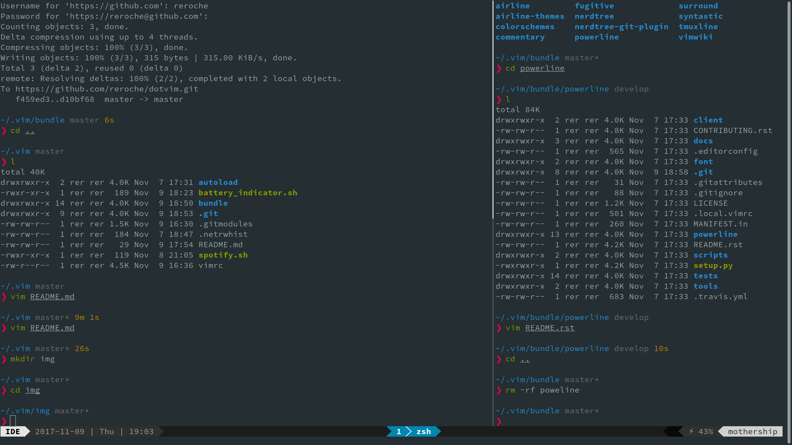

# .vim

## My Vim Configuration

### Files:
- `vimrc`
- `battery_indicator.sh`: Displays battery percentage in the terminal status line.
- `spotify.sh`: Displays song playing on Spotify in the terminal status line.

### Submodules:
- [nerdtree](https://github.com/scrooloose/nerdtree)
- [nerdtree-git-plugin](https://github.com/Xuyuanp/nerdtree-git-plugin)
- [syntastic](https://github.com/vim-syntastic/syntastic)
- [tmuxline](https://github.com/edkolev/tmuxline.vim)
- [vim-airline](https://github.com/vim-airline/vim-airline)
- [vim-airline-themes](https://github.com/vim-airline/vim-airline-themes)
- [vim-colorschemes](https://github.com/flazz/vim-colorschemes)
- [vim-commentary](https://github.com/tpope/vim-commentary)
- [vim-fugitive](https://github.com/tpope/vim-fugitive)
- [vim-markdown-preview](https://github.com/reroche/vim-markdown-preview)
- [vim-surround](https://github.com/tpope/vim-surround)
- [vimwiki](https://github.com/vimwiki/vimwiki)

### Other
- I use the GNOME Terminal, with TMUX.
- The font I use can be found here: [Powerline Fonts](https://github.com/powerline/fonts)
- The color scheme shown in the images is Freya.
